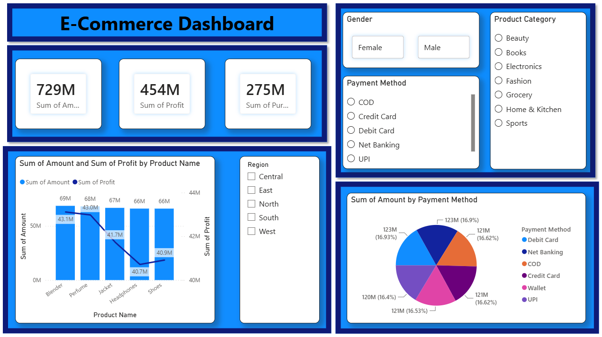

# E-Commerce Sales Dashboard | Power BI

## Project Overview

This project is an interactive **E-Commerce Sales Dashboard** developed using **Microsoft Power BI**. The dashboard provides insights into sales, profit, purchases, product performance, regional performance, customer demographics, and payment methods.

The objective of this project is to transform raw e-commerce sales data into meaningful business insights through interactive visualizations and filters.

## Dashboard Preview

## Key Features

- Total Sales analysis
- Total Profit analysis
- Total Purchase analysis
- Product-wise Sales and Profit comparison
- Region-wise filtering
- Gender-based customer analysis
- Product Category filtering
- Payment Method analysis
- Interactive slicers and filters

## Dashboard KPIs

- **Total Sales:** 729M
- **Total Profit:** 454M
- **Total Purchases:** 275M

## Tools & Technologies

- Microsoft Power BI
- Power Query
- DAX
- Data Modeling
- Microsoft Excel
- Data Visualization

## Dashboard Visualizations

- KPI Cards for Sales, Profit and Purchases
- Sales & Profit by Product
- Sales by Payment Method
- Region Slicer
- Gender Slicer
- Product Category Slicer
- Payment Method Slicer

## Project Files

- `ecommerce_dashboard.pbix` - Power BI dashboard file
- `ecommerce_huge_sales_data_with_purchase_cost.xlsx` - Dataset used for analysis
- `dashboard-preview.png` - Dashboard preview

## Author

**Zafar Ahmad**

Data Analytics | Power BI | Excel | SQL | Tableau
